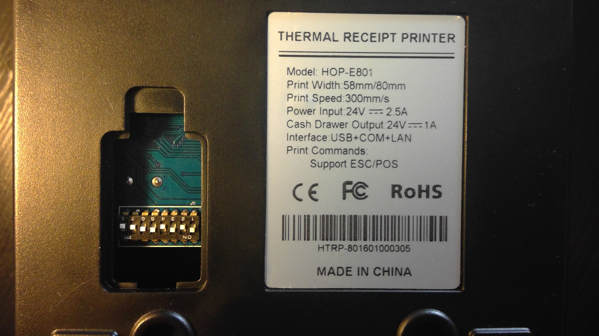
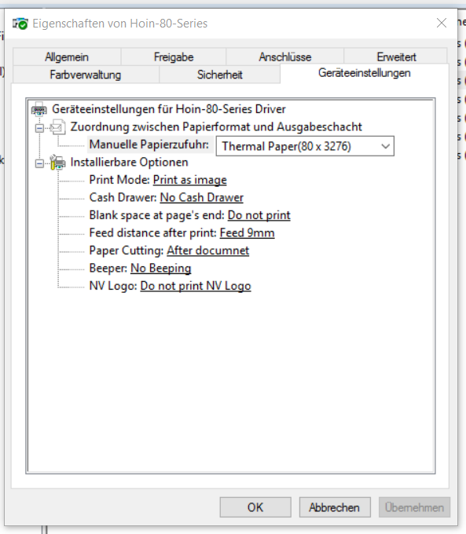

###Inbetriebnahme
1. Installation des Drivers 80MM für 80 mm breites Thermopapier
2. Installation des Drivers 50MM für 50 mm breites Thermopapier
3. Pinbelegung des Druckers wie folgt: **1, 3, 5, 6 auf on** der Rest auf off (unabhängig von 50 mm oder 80 mm)  
    
4. Drucker aufdrehen und per USB mit Computer verbinden.
5. Druckereinstellungen anpassen:  
    

###Erfahrungen
+ Der Drucker kann ohne Probleme auf Windows 10 Version	10.0.10586 Build 10586 installiert werden.
+ Er funktioniert zuverlässig und schnell und kann ohne Probleme Dokumente Drucken, wie ein Word oder auch Bilder.
+ Er kann 80 mm breites Thermopapier bedrucken und genauso 50 mm
+ Am unteren Boden besitzt er "jumper" diese müssen richtig eingestellt werden.
  + Ich konnte kaum eine sinnvolle Variante finden, vorlallem aber wird die Papierbreite dadurch bestimmt welchen Windows treiber man verwendet und nicht welche Pinbelegung aktiv ist.
  + Trotzdem ist die Pinbelegung wichtig. Erfahrungsgemäß funktionieren beide Treiber mit folgender Pinbelegung: **1,3,5,6 auf** on die anderen auf off
+ Leider und das ist ein großer Nachteil ist es nicht möglich von dem Drucker Statusmeldungen nach C# zu delegieren. Bzw war mir das nach 4 stündigem ausprobieren von verschiedenster Tricks nach wie vor nicht möglich.
